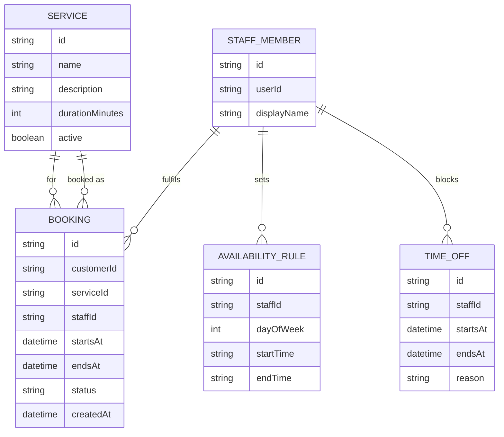

# Domain Model

The booking agent tracks one business's services, the working hours and time
off of its staff, and the appointments customers book against that
availability.

- A **Service** is offered by the business; only `active` services can be booked.
- A **StaffMember** links a signed-in Staff user to their availability and bookings.
- An **AvailabilityRule** is a recurring weekly working-hours slot; a **TimeOff**
entry blocks part of that recurring availability for a specific date range.
- A **Booking** reserves one service, at one time slot, with one staff member,
for the customer who made it; `status` is one of `confirmed` or `cancelled`.

