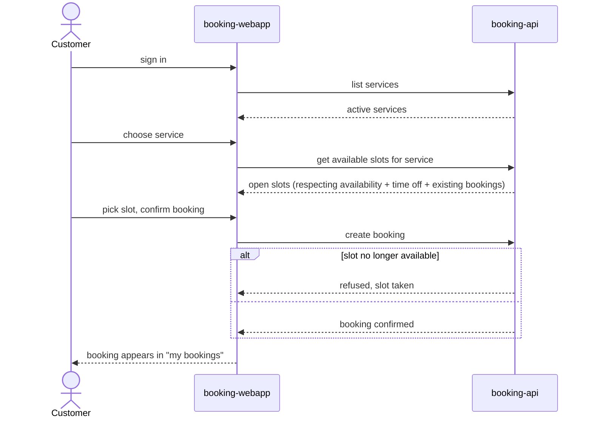

# Customer books an appointment

A signed-in Customer picks a service, finds an open time slot, and books it;
the booking then shows up on Staff's calendar.

```mermaid
sequenceDiagram
    actor Customer
    participant webapp as booking-webapp
    participant api as booking-api

    Customer->>webapp: sign in
    webapp->>api: list services
    api-->>webapp: active services
    Customer->>webapp: choose service
    webapp->>api: get available slots for service
    api-->>webapp: open slots (respecting availability + time off + existing bookings)
    Customer->>webapp: pick slot, confirm booking
    webapp->>api: create booking
    alt slot no longer available
        api-->>webapp: refused, slot taken
    else
        api-->>webapp: booking confirmed
    end
    webapp-->>Customer: booking appears in "my bookings"
```

