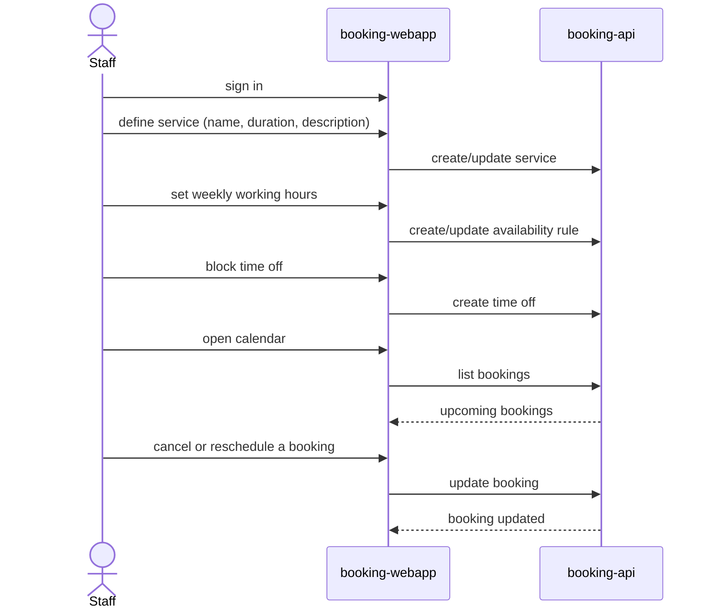

# Staff manages schedule and bookings

A signed-in Staff member defines services and availability, then reviews and
adjusts the resulting calendar of bookings.

```mermaid
sequenceDiagram
    actor Staff
    participant webapp as booking-webapp
    participant api as booking-api

    Staff->>webapp: sign in
    Staff->>webapp: define service (name, duration, description)
    webapp->>api: create/update service
    Staff->>webapp: set weekly working hours
    webapp->>api: create/update availability rule
    Staff->>webapp: block time off
    webapp->>api: create time off
    Staff->>webapp: open calendar
    webapp->>api: list bookings
    api-->>webapp: upcoming bookings
    Staff->>webapp: cancel or reschedule a booking
    webapp->>api: update booking
    api-->>webapp: booking updated
```

